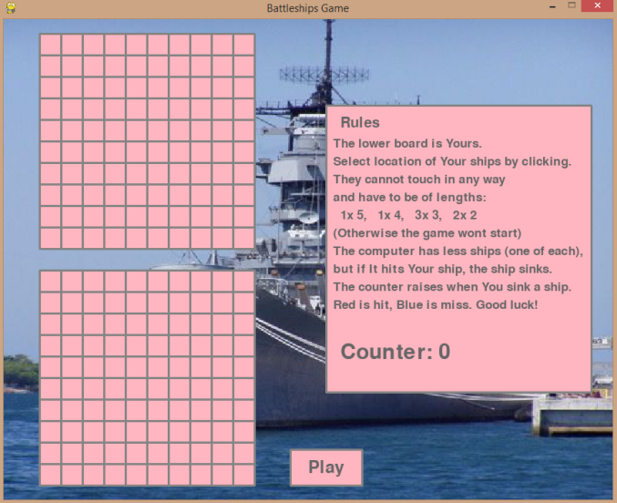
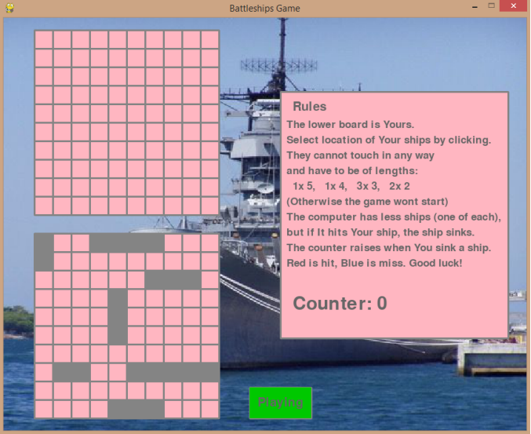
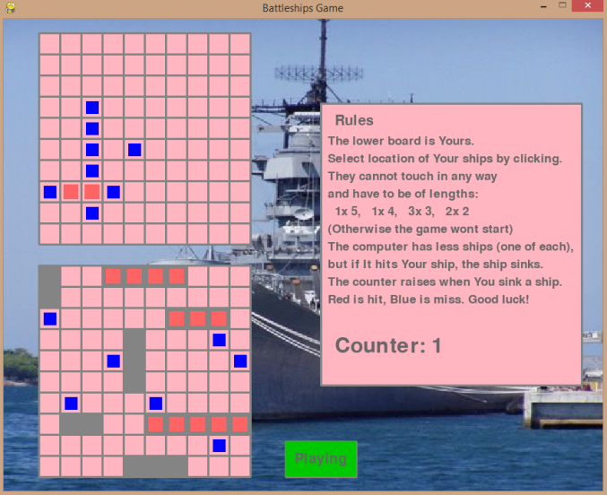
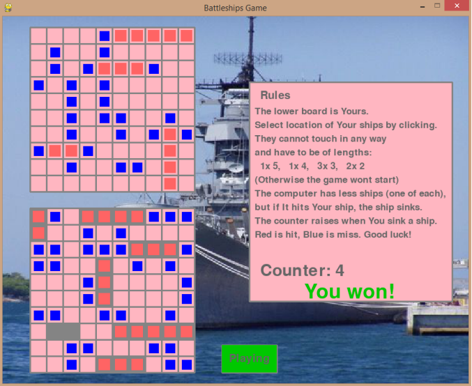
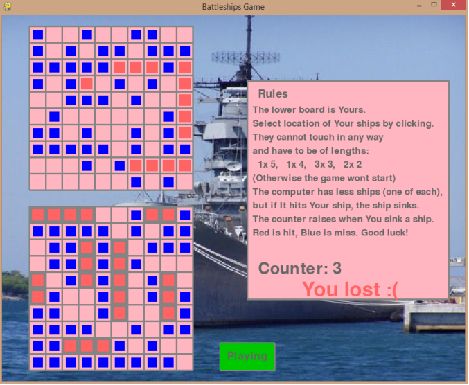

# Battleships Game

A basic battleships game written in Python, with use of pygame.

## How to play

The game is a variation of classic battleships game. You can guess fields where computer's ships are located, 
but the computer takes blind shots with way better amunition ;) So when he hits one of your ships it immediately 
goes down. You have to outrace the computer in sinking ships. 

If you want to play, download the files, in file main.py change the filepath in line 615 to the path of the downloaded 
background picture on your computer. Then simply run main.py (make sure you have Python installed on your computer).

## How the game looks

